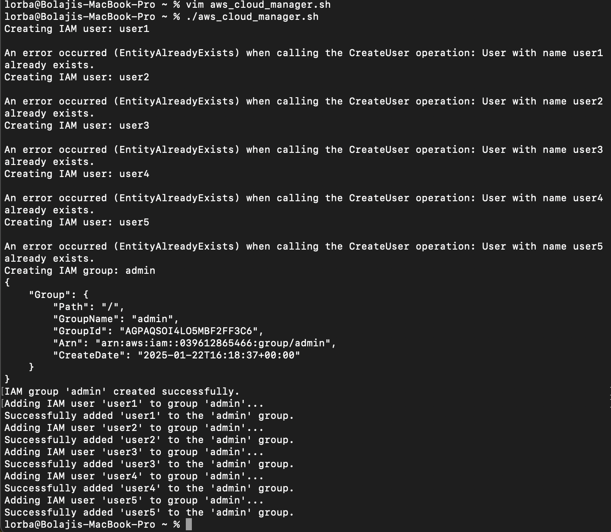

# Capstone Project - Linux Administration and Shell Scripting

## Capstone Project: Shell Script for AWS IAM Management

**# IAM Management**

*# Declaring an array with five IAM user names*

`automation_user=("user1" "user2" "user3" "user4" "user5")`

*#Loop through the array to create IAM users*

`for user in "${automation_user[@]}"; do`
  `echo "Creating IAM user: $user"`
  `aws iam create-user --user-name "$user"`
'done'

### The below translate that automation_users in arrays contains five IAM user names.

`automation_users=("user1" "user2" "user3" "user4" "user5")`

### Loop Through the Array:

This loops through each element in the array, storing the current element in the variable user.

`for user in "${iam_users[@]}"; do`

## Create IAM Users:

The AWS CLI command creates an IAM user with the name stored in user.

`aws iam create-user --user-name "$user"`

The image below shows how the users are been created on my AWS CLI after which the script have been executed.

### Defining function to create an IAM group named "admin" using the AWS CLI.

`create_admin_group() {`
`group_name="admin"`
`echo "Creating IAM group: $group_name"`

The below specifies the group name as "admin".

`group_name="admin"`

The below code is use to call the function to execute and it comes at the end of the script.

`create_admin_group`

 ## Create the group

 The below creates the IAM group with the specified name.

`aws iam create-group --group-name "$group_name"`

## Attaching Administrative Policy to Group:

`aws iam attach-group-policy --group-name admin --policy-arn arn:aws:iam::aws:policy/AdministratorAccess`

This below attaches a policy to an IAM group.

`aws iam attach-group-policy`

Below Specifies the name of the IAM group to which the policy will be attached (in this case, admin).

 `--group-name`

Below Specifies the Amazon Resource Name (ARN) of the policy to attach. For AdministratorAccess, the ARN is: arn:aws:iam::aws:policyAdministratorAccess

 `--policy-arn`

### Error Checking:

 *#Check the exit status*

  `if [[ $? -eq 0 ]]; then`
    `echo "IAM group '$group_name' created successfully."`
  `else`
    `echo "Failed to create IAM group '$group_name'. Please check for errors."`
  `fi`
`}`
The $? variable checks the exit status of the previous command. A value 0 indicates success.

### If successful: The output display below

Creating IAM group: admin
IAM group 'admin' created successfully.

### If unsuccessful:

Creating IAM group: admin
Failed to create IAM group 'admin'. Please check for errors.

 ## Assigning User to Group

### Declaring an array of IAM user names

automation_user=("user1" "user2" "user3" "user4" "user5")

### IAM group name

`group_name="admin"`

### Iterate through the array and add each user to the "admin" group

This iterates over each user in the array, and for each user:
for user in "${automation_user[@]}"; do
  echo "Adding IAM user '$user' to group '$group_name'..."

  ### Add user to the group

  The aws iam add-user-to-group command assigns the user to the group.

  `aws iam add-user-to-group --user-name "$user" --group-name "$group_name"`

  ### Check the exit status

  The exit status ($?) is checked to ensure the command succeeded.

  `if [[ $? -eq 0 ]]; then`
    `echo "Successfully added '$user' to the '$group_name' group."`
  `else`
    `echo "Failed to add '$user' to the '$group_name' group. Please check for errors."`
  `fi`
`done`

### Output Success:

Adding IAM user 'user1' to group 'admin'...
Successfully added 'user1' to the 'admin' group.

### Failure Output:

Adding IAM user 'user1' to group 'admin'...
Failed to add 'user1' to the 'admin' group. Please check for errors.

The Below image shows how the Admin is been created and how the users are been added to the group on my AWS CLI

